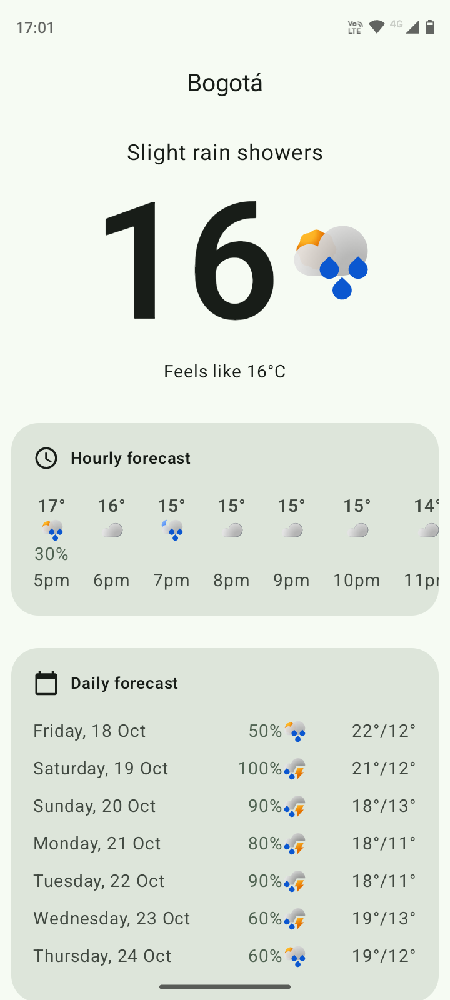
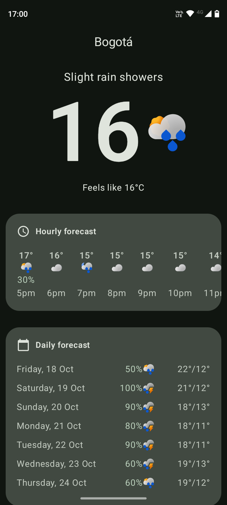
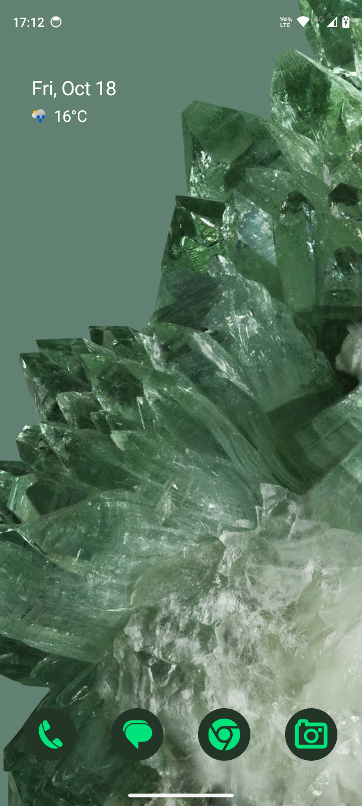

# Pixel Weather Clone

This application is a clone of Google's Pixel Weather app, created for learning purposes. It is built using Kotlin and Jetpack Compose.

## Technologies Used
- **Kotlin**: A modern programming language that makes developers happier.
- **Jetpack Compose**: Android’s modern toolkit for building native UI.

## Purpose
The primary goal of this project is to understand and practice building Android applications using Kotlin and Jetpack Compose.

## Screenshots

| Light mode | Dark mode | Glance Widget |
|------------|-----------|---------------|
|  A screenshot showing the app in light mode, demonstrating the clean and intuitive user interface. |  A screenshot showing the app in dark mode, highlighting the sleek and modern design. |  A screenshot of the Glance Widget, showcasing the quick and easy access to weather information directly from the home screen. |
